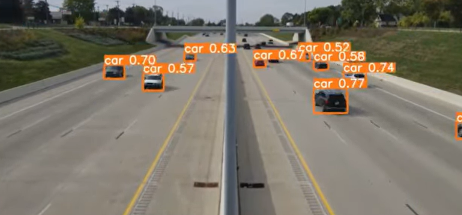
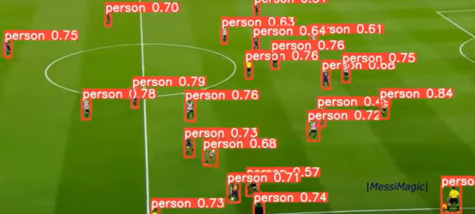
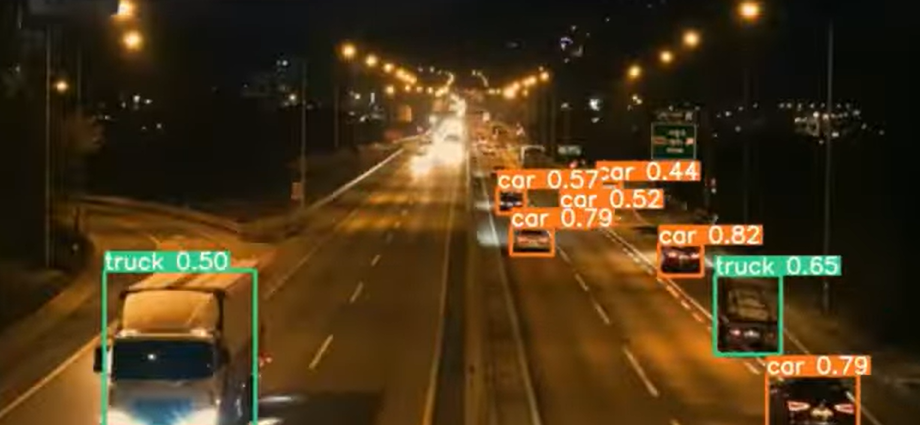

# SpotTrack — YOLOv5 + DeepSort (PyTorch)

---
Lightweight, real-time multi-object tracking that combines YOLOv5 detections with a Deep SORT–style re-identification tracker in PyTorch. Configurable for speed or accuracy; runs on images, video, webcams and streams; tracks any object classes your YOLOv5 model is trained to detect.
Demo 1 -  Demo 2 - 
Demo 3 - 

## Quick start

```bash
# clone this repo
git clone --recurse-submodules https://github.com/Ajad-cpu/SpotTrack.git
cd SpotTrack

# install (Python 3.8+)
pip install -r requirements.txt
```

---

## Run tracker

```bash
# webcam
python track.py --source 0

# image, video, folder, YouTube or stream
python track.py --source img.jpg
python track.py --source vid.mp4
python track.py --source 'https://youtu.be/...'
python track.py --source 'rtsp://...'
```

---

## Choose YOLOv5 model

```bash
# use a specific YOLOv5 weights file and image size
python track.py --source 0 --yolo_weights yolov5s.pt --img 640
```

---

## Track specific classes

```bash
# track persons only (COCO class 0)
python track.py --source 0 --classes 0
```

---

## Save results

```bash
# save tracking results as text (bounding boxes + IDs)
python track.py --source ... --save-txt
```

---

## Files of interest

* `track.py` — main tracking entrypoint for images, videos, streams.
* `requirements.txt` — Python dependencies.
* `LICENSE` — GPL-3.0 license.

---

## About

SpotTrack combines YOLOv5 detection with a DeepSORT-style tracker in PyTorch so you can run fast, real-time multi-object tracking on CPUs/GPUs and adapt to different models and classes.

---

## License

This project is released under the GPL-3.0 license.
